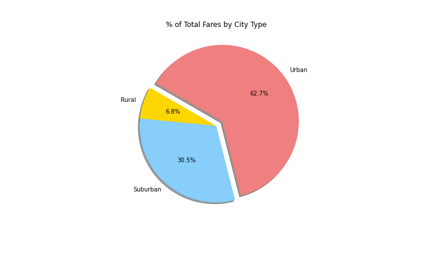
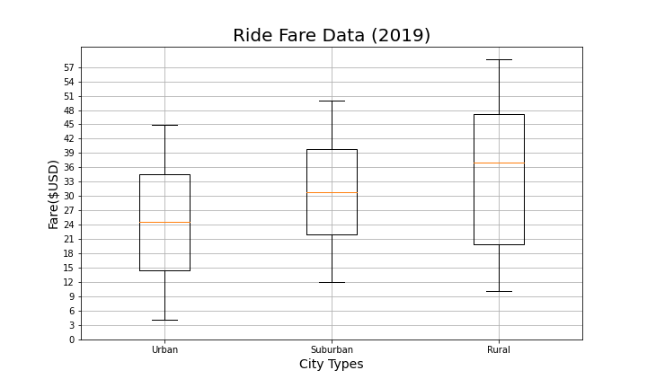
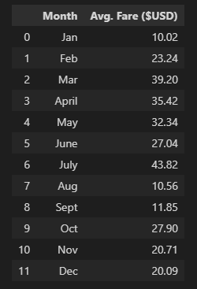

# PyBer_Analysis

## Overview
  -In this weeks project I was tasked with organizing and plotting data from a ride share company(PyBer). My main goal was to find total drivers per city, differences in number of drivers and rides/fares per city and to plot them on readable graphs outlining the data clearly.
  
## Results 
  -In my findings I will show below comparisons of each city and fare type with a few different graphs relative t othe project. 
  -I feel that findings were fairly predictable being that you will see that Urban fares and total percent of drivers is largly outweighing that of Rural and Suburban drivers and fares. I think this is due to Urban areas generally having a much larger population with more going on. 
  
  
  
  
  
  -I would also like to point out when I plotted the data sets on a box and whisker plot it was much easier for me to see that ride fare across the three city types was actually pretty equal. The outliers were very apparent and far between but when it came to the average fare it was suprisingly cloe. 
  
  
  
## Conclusion
  -After reviewing the data set and putting the graphs and charts together I feel that there a few things that I would like to recommend to help the drivers and riders from city to city. 
  -First when i'm looking at pay differential from rural areas to urban areas it could benefit the drivers morale greatly in the rural areas if they were compensated more to make up for the waiting around since they're such few rides compared to urban areas which see more customer traffic and mroe opportunity for higher paying shifts. Below is an example of that difference in pay. 
   -Second if there is a way to help the drivers in the other two areas by giving the drivers in urban areas some incentive to drive out into the suburban and rural area might be beneficial to keep customers happy and always able to find a ride in an appropriate amount of time no matter the area they are in. Below I have put in an example of the driver amounts differing from are to area. 
   
   
   
  -Last I would like to suggest looking at general ride fare prices. It seems to me that I noticed a lot of fluctuation in fare from month to month with no trend really being able to be seen. 
  
  
